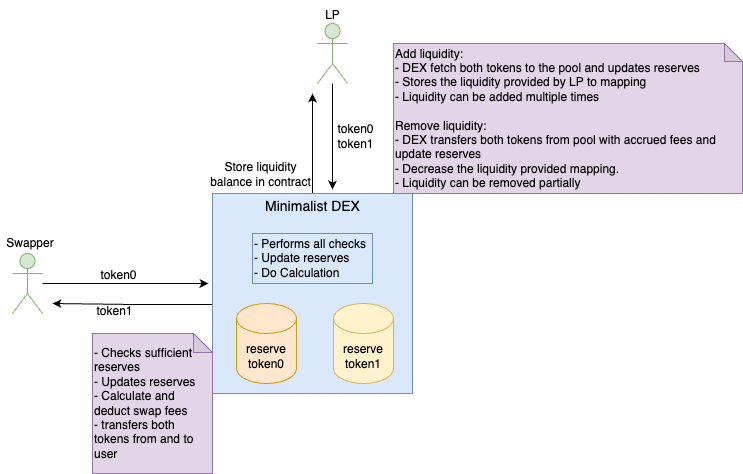

## Mininalist DEX - Trade.Fi

## Execution flow diagram



## Deployment (ETH Sepolia)

MinimalDEX: [0x37C318A2aDE99c05576FDacfF9bc78c4C966DF7b](https://sepolia.etherscan.io/address/0x37C318A2aDE99c05576FDacfF9bc78c4C966DF7b)

Token0:[0xdD130a1A09c28d3EfE46fdfC76BFD440507570e3](https://sepolia.etherscan.io/address/0xdD130a1A09c28d3EfE46fdfC76BFD440507570e3)

Token1: [0xE9181Bc5704670F2280186Fc2c32F897dE7346f3](https://sepolia.etherscan.io/address/0xE9181Bc5704670F2280186Fc2c32F897dE7346f3)

## Documentation

https://book.getfoundry.sh/

## Usage

### Build

```shell
$ forge build
```

### Test

```shell
$ forge test
```

### Format

```shell
$ forge fmt
```

### Gas Snapshots

```shell
$ forge snapshot
```

### Anvil

```shell
$ anvil
```

### Deploy

```shell
$ forge script script/Counter.s.sol:CounterScript --rpc-url <your_rpc_url> --private-key <your_private_key>
```

### Cast

```shell
$ cast <subcommand>
```

### Help

```shell
$ forge --help
$ anvil --help
$ cast --help
```
